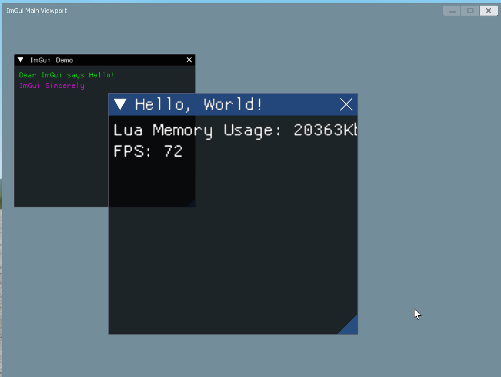

# ImGui Sincerely

> "Give someone state and they'll have a bug one day, but teach them how to represent state in two separate locations that have to be kept in sync and they'll have bugs for a lifetime." - [ryg](https://twitter.com/rygorous/status/1507178315886444544)

## Current State

| Subsystems | Stage                            |
| ---------- | -------------------------------- |
| Fonts(ttf) | Completed, syncing with main     |
| Fonts(otf) | Hasn't started yet, not planned  |
| Viewports  | Currently only one is supported  |
| Windows    | WIP                              |
| Widgets    | WIP                              |
| Backends   | Currently only have GMod backend |

### My Developing Platform

`GMod x86-64 branch (2026.1.21)` with `LuaJIT 2.1.0-beta3`, `Lua 5.1`. Recording this is actually necessary, since who knows how GMod Lua APIs will change in the future!

The core code(code except backend ones) in [lua/](lua) don't and shouldn't use anything that is exclusive in GMod Lua.

## Primary Goal

Try to make an *Immediate Mode UI* library for Garry's Mod.

In other words, currently I'm implementing an ImGui clone in **pure Lua**.

Originally I just wanted to make some contributions to [RiceLib](https://github.com/RiceMCUT/Lib-Rice), and it wasn't the first time that I got terrified by the messy and bloat codebase of it. So I set out to remove all the non-UI related features added by *RiceLib* author [RiceMCUT](https://github.com/RiceMCUT) and to make UI creation for GMod in general easier.

## Credits

Thanks to [Dear ImGui](https://github.com/ocornut/imgui)!

References:

- [Garry's Mod Wiki](https://wiki.facepunch.com/gmod/)
- [Jaffies's paint lib](https://github.com/Jaffies/paint)
- [Valve Developer Wiki](https://developer.valvesoftware.com/wiki/Main_Page)
- [handsomematt's 3d2d-vgui](https://github.com/handsomematt/3d2d-vgui)
- [TomDotBat's ui3d2d](https://github.com/TomDotBat/ui3d2d)

Previous Attempts at immediate-mode UIs in GMod:

- [wyozi's imgui](https://github.com/wyozi-gmod/imgui)
- [Fun Project GMod's imgui](https://github.com/fun-project-gmod/imgui)

AIs:

- [DeepSeek](https://www.deepseek.com/),
- [KIMI K2 Thinking](https://www.kimi.com/),
- [TRAE](https://www.trae.ai/)

for helping me avoid those areas involving a lot of repeatitive work!
