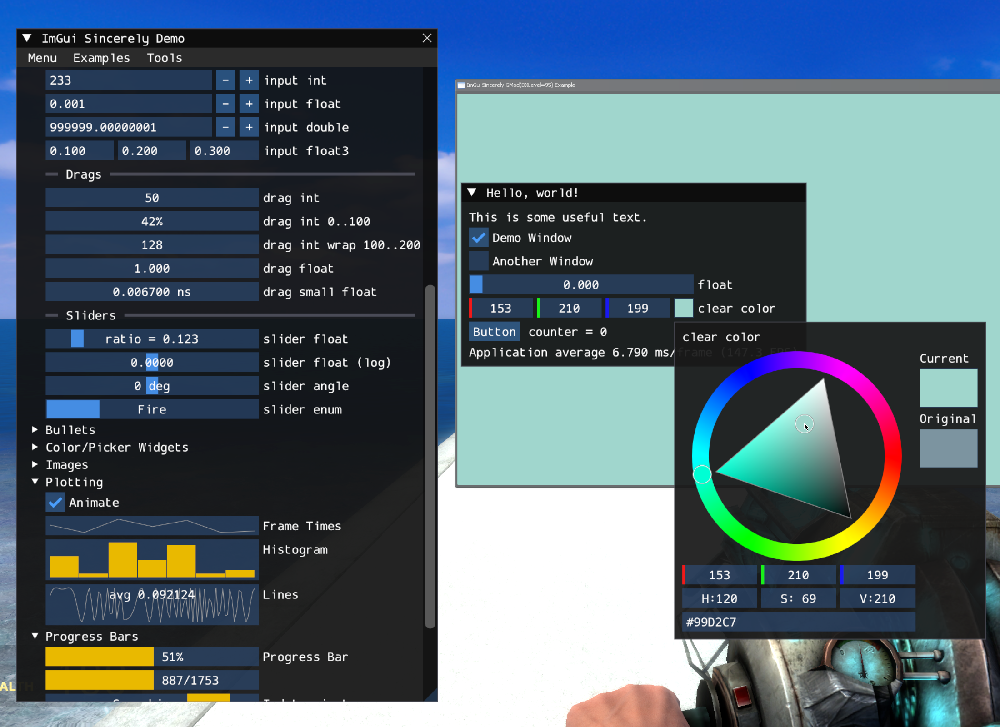

# ImGui Sincerely

> "Give someone state and they'll have a bug one day, but teach them how to represent state in two separate locations that have to be kept in sync and they'll have bugs for a lifetime." - ryg

## Progress

_This image may be outdated!_ 

| Subsystems | Stage                            |
| ---------- | -------------------------------- |
| Fonts(ttf) | Completed, syncing with `main`   |
| Fonts(otf) | Not planned                      |
| Viewports  | Completed, syncing with `docking`|
| Docking    | Maybe soon                       |
| Backends   | Currently only have GMod backend |

Loading [FreeType](https://github.com/freetype/freetype) fonts and `Docking` might be too advanced for GMod/Games that enable Lua scripting. I don't think people need that. And they take a lot of time to re-write in Lua so anybody can resort to real binary modules!

| Widget Kinds | GMod Derma (VGUI) | ImGui Sincerely (This Port) | Additional Info |
| - | - | - | - |
| Button | DButton, DImageButton | Button, SmallButton, `ImageButton` | `ImageButton` requires user registered texture/RT |
| Checkbox | DCheckBox, DCheckBoxLabel | Checkbox | - |
| Text Input | `DTextEntry`, `DNumberWang` | InputText, InputFloat/Int | `DNumberWang` has poor support for numeric data types |
| Slider/Drag | DNumSlider | SliderFloat/Int, DragFloat/Int, VSliders | - |
| Label | RichText, `DLabel` | Text, LabelText, TextColored, TextDisabled | `DLabel` has limited APIs for controlling text wrapping |
| Window | `DFrame` | Begin + End, BeginChild + EndChild(child windows) | - |
| Menu | DMenuBar, DMenu, DMenuItem | `BeginMenuBar` + `EndMenuBar`, `BeginMenu` + `EndMenu`, MenuItem | - |
| Tree | `DTree` | `TreeNode` + `TreePop` | `DTree` has limited APIs. And you'll need to touch `DTree`, `DTree_Node`, `DTree_Node_Button` internals if wanting to do something complex. Warning! Derma uses inheritance heavily since it's OO and retained |
| Scroll | `DHorizontalScroller`, `DScrollPanel`(they internally uses `DHScrollBar` or `DVScrollBar`) | Configurable, automatic scroll bars. `ImGuiListClipper` currently **NYI** | - |
| Image | `DImage` | `Image` | Requires user registered texture/RT |
| Color | `DColorMixer`, DColorButton | ColorButton, ColorEdit3/4, `ColorPicker4`(selectable color cube / hue wheel + sv triangle) | `DColorMixer` only supports color cube(`DColorCube`), has limited options, and does not have popups |
| Progress | DProgressBar | ProgressBar | - |
| Tooltip | DTooltip | BeginTooltip + EndTooltip | - |
| Tabs | `DPropertySheet` | **NYI** | - |
| Collapsible | DCategoryList, DCollapsibleCategory | CollapsingHeader | - |
| Layout | DForm, DGrid, DIconLayout | SameLine, Spacing, BeginGroup, ... | - |
| Plot | - | `PlotLines`, `PlotHistogram` | - |
| Selectable | `DComboBox` | BeginCombo + EndCombo, Selectable(primitive widget), RadioButton | - |
| Drag & Drop | `dragndrop` lib | **NYI** | - |
| Table | `DListView` | **NYI** | `DListView` APIs are very limited compared to ImGui Tables API |
| Bullet | - | Bullet, BulletText | - |
| 3D Model Display | `DModelPanel` | **NYI** | Possible with `Image()` + user registered texture/RT that renders the scene |
| HTML | `DHTML` | **NYI** | Possible with `Image()` + user registered texture/RT that renders the page |
| File Browser | `DFileBrowser` | **NYI** | Possible with existing APIs + platform specific APIs |

_The tables above may provide limited information!_

### Notes

Roadmap and task list: [TODO](misc/TODO.md)

Things to pay attention to: [PORT](misc/PORT.md)

Please refer to official Dear ImGui docs or src code comments for documentation!

### How to Try it in GMOD?

1. Clone this project into your GMod `addons` folder
2. Create a singleplayer or multiplayer game
3. Run `imgui_test` command in engine console
4. You can also write your own test scripts and run them!

### My Development Platform

GMod: `x86-64 branch` with `LuaJIT 2.1.0-beta3`, `Lua 5.1`.

The core code(code except backend ones) in [lua/](lua) don't and shouldn't use anything that is exclusive in GMod Lua.

## Primary Goal

Implementing a Dear ImGui clone in **pure Lua**.

## Credits

Thanks to [Dear ImGui](https://github.com/ocornut/imgui)!

References:

- [GitSparTV's LuaJIT Benchmarks](https://gitspartv.github.io/LuaJIT-Benchmarks/)
- [Garry's Mod Wiki](https://wiki.facepunch.com/gmod/)
- [Jaffies's paint lib](https://github.com/Jaffies/paint)
- [Valve Developer Wiki](https://developer.valvesoftware.com/wiki/Main_Page)

Previous Attempts at immediate-mode UIs in GMod:

- [wyozi's *imgui*](https://github.com/wyozi-gmod/imgui)
- [Artemking4's fun-project-gmod/*imgui*](https://github.com/fun-project-gmod/imgui)

AIs: for helping me avoid those areas involving a lot of repeatitive work!
